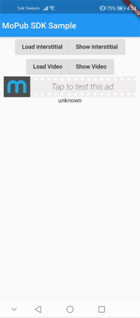
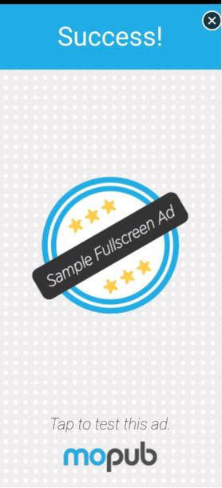
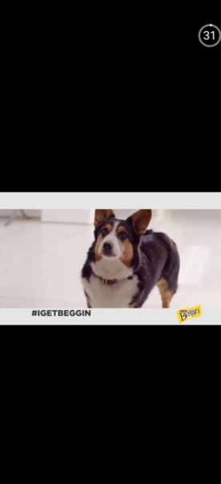
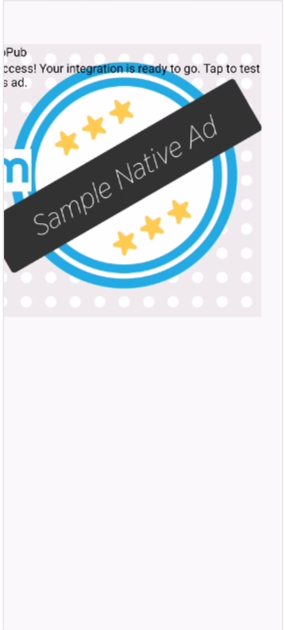
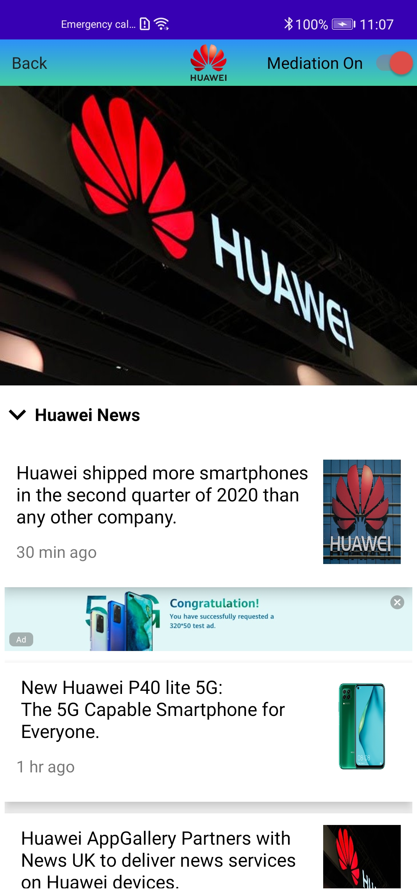
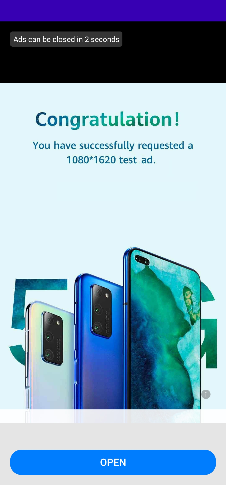
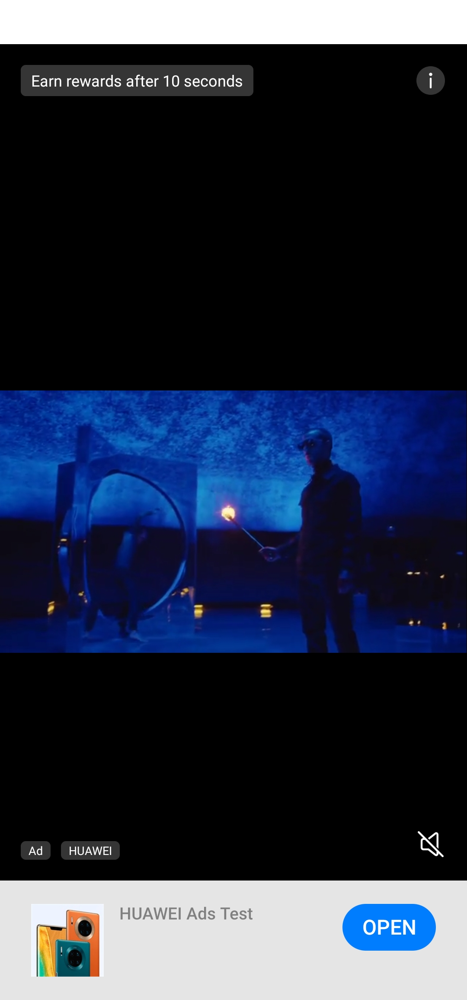
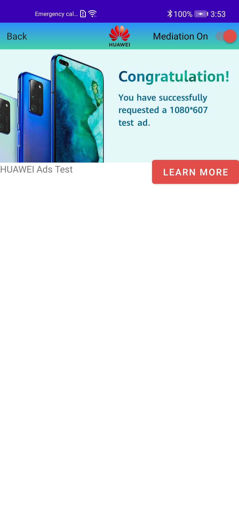

# Huawei-Mopub Mediation Github Documentation

 

This is a project to demonstrate how to use MoPub’s mediation feature with Huawei Ads Kit.

# Compatibility

|   | Banner Ad | Interstitial Ad | Rewarded Ad | Native Ad |
| --- | --- | --- | --- | --- |
| Native (Java/Kotlin) | ✅ | ✅ | ✅ | ✅ |
| React Native | ❌ | ✅ | ❌ | ❌ |
| Flutter |✅|✅| ✅ | ❌ |
| Cordova |❌|❌| ❌ | ❌ |

# How to start?
  
## Create an ad unit on Huawei Publisher Service

1. Sign in to [Huawei Developer Console] (https://developer.huawei.com/consumer/en/console) and create an AdUnit

## Create a custom event on MoPub:
1. Sign in to your [Huawei Developer Console](https://developer.huawei.com/consumer/en/console) and create an AdUnit
2. Sign in to your [MoPub console](https://app.mopub.com/)
3. Go to one of your orders and create a new line item
4. Select **Network line item** as the type
5. Select **Custom SDK network** as the network
6. Enter the **Custom event class** and **Custom event data** according to the type of your Ad. Refer to the section below.

## Custom event class
| Ad Type        | Custom event class           |
| ------------- |:-------------:|
| Banner Ad      | com.hmscl.huawei.ads.mediation_adapter_mopub.banner |
| Interstitial Ad      | com.hmscl.huawei.ads.mediation_adapter_mopub.interstitial     |
| Rewarded Video Ad | com.hmscl.huawei.ads.mediation_adapter_mopub.rewarded     |
| Native Ad (Basic) | com.hmscl.huawei.ads.mediation_adapter_mopub.native_basic    |
| Native Ad (Advanced) | com.hmscl.huawei.ads.mediation_adapter_mopub.native_advanced    |

## Custom Event Parameters

### Banner, Interstitial, Rewarded
```
{
    "adUnitID": "111",  <-- Required
    "appid":"222",
    "tagForChildProtection": "false",
    "tagUnderAgeOfPromise": "false",
    "tagAdContentClassification": "false",
    "tagConsentString": "false",
}
```

### Native
```
{
    "adUnitID": "111",  <-- Required
    "appid":"222",
    "tagForChildProtection": "false",
    "tagUnderAgeOfPromise": "false",
    "tagAdContentClassification": "false",
    "tagConsentString": "false",
    "orientation_preference" : "1"
    "ad_choices_placement" : "1"
    "swap_margins" : "1"
}
```

| Key | Description | Possible value |
| --- | --- | --- |
| adUnitID  | Huawei Ads Unit ID | String |
| appid | Huawei Ads App ID | String |
| tagForChildProtection | Sets the tag for child-directed content, to comply with the Children's Online Privacy Protection Act (COPPA). | <ul><li>`true`: You want your ad content to be COPPA-compliant (interest-based ads and remarketing ads will be disabled for the ad request). </li><li>`false`: You do not want your ad content to be COPPA-compliant. </li></ul> |
| tagUnderAgeOfPromise | Sets the tag for users in the European Economic Area (EEA) under the age of consent, to comply with the General Data Protection Regulation (GDPR). Ad requests with this tag enabled will be unable to obtain personalized ads. | <ul><li> `true`: You want the ad request to meet the ad standard for users under the age of consent. </li><li> `false`: You do not want the ad request to meet the ad standard for users under the age of consent. </li></ul>  |
| tagAdContentClassification | Sets the maximum ad content rating for the ad requests of your app. The ads obtained using this method have a content rating at or below the specified one. | <ul><li> `w`: content suitable for widespread audiences. </li><li> `pi`: content suitable for audiences under parental instructions. </li><li> `j`: content suitable for junior and older audiences. </li><li> `a`: content suitable only for adults. </li></ul> |
| tagConsentString | Sets the user consent string that complies with TCF 2.0. | String |
| orientation_preference (Native specific) | Sets the orientation of an ad image. | <ul><li> `0`: ANY </li><li> `1`: PORTRAIT </li><li> `2`: LANDSCAPE </li></ul> |
| ad_choices_placement (Native specific) | Sets the AdChoices icon position | <ul><li> `0`: TOP_LEFT </li><li> `1`: TOP_RIGHT </li><li> `2`: BOTTOM_RIGHT </li><li> `3`: BOTTOM_LEFT </li></ul> |
| swap_margins (Native specific) | Configure margin | <ul><li> `true`: Set margin on </li><li> `false`: Set margin off </li></ul> |

> Note: All values ​​must be String format.

Also all values can be set dynamically.

```
moPubNative.setLocalExtras(
    mapOf(
        TAG_FOR_CHILD_PROTECTION_KEY to true,
        TAG_FOR_UNDER_AGE_OF_PROMISE_KEY to true,
        TAG_FOR_AD_CONTENT_CLASSIFICATION_KEY to true,
        TAG_CONSENT_STRING to "TCF 2.0 String",
        KEY_EXTRA_ORIENTATION_PREFERENCE to 1,
        KEY_EXTRA_AD_CHOICES_PLACEMENT to 1,
        KEY_EXPERIMENTAL_EXTRA_SWAP_MARGINS to 1
    )
)
```
> Note: Be aware that custom events parameters in Mopub platform will override your code side changes on the parameters.

[Mediation Child Protection Document](https://github.com/yilmazgokhan/temp-readme/blob/main/Huawei_Mopub_Mediation_Child_Protection.pdf)

# Integrate the Huawei Mediation SDK

In the project-level build.gradle, include Huawei’s maven repository

```groovy
repositories {
    google()
    jcenter() // Also, make sure jcenter() is included
    maven { url 'https://developer.huawei.com/repo/' } // Add this line
}

...

allprojects {
    repositories {
        google()
        jcenter() // Also, make sure jcenter() is included
        maven { url 'https://developer.huawei.com/repo/' } //Add this line
    }
}
```
In the app-level build.gradle, include Huawei Ads dependency (required by the adapter) and the Huawei mediation adapter

```groovy
dependencies {
    implementation 'com.huawei.hms:ads:3.4.41.304'
    implementation 'com.github.Explore-In-HMS:huawei.ads.mopub_mediation:<latest_version>'
}
```
**Important:**: To add Huawei Ads Kit SDK and Mediation adapter to the cross platforms apps, the native project should be opened with Android Studio.

**Important:** A device with Huawei Mobile Services (HMS) installed is required.

# Platforms

## **Native**

This section demonstrates how to use MoPub mediation feature with Huawei Ads Kit on Native Android app. 

Firstly, integrate the MoPub SDK for Android:

[MoPub Android SDK](https://developers.mopub.com/publishers/android/integrate/) can be used for all ad types.

**Note:** Developers can find app level build.gradle in their project from __**"app-folder/app/build.gradle"**__

### **Banner Ads**

To use Banner ads in Native android apps, please check the MoPub SDK. Click [here](https://developers.mopub.com/publishers/android/banner/) to get more information about MoPub SDKs Banner Ad development.

### **Interstitial Ads**

To use Interstitial ads in Native android apps, please check the MoPub SDK. Click [here](https://developers.mopub.com/publishers/android/interstitial/) to get more information about MoPub SDKs Interstitial Ad development.

### **Rewarded Ads**

To use Rewarded ads in Native android apps, please check the MoPub SDK. Click [here](https://developers.mopub.com/publishers/android/rewarded-ad/) to get more information about MoPub SDKs Rewarded Ad development.

### **Native Ads**

To use Native ads in Native android apps, please check the MoPub SDK. Click [here](https://developers.mopub.com/publishers/android/native-recyclerview/) to get more information about MoPub SDKs Native Ad development.

## React Native

This section demonstrates how to use MoPub mediation feature with Huawei Ads Kit on React Native apps.

**Important:** There is no official React Native SDK for MoPub, therefore third party SDKs has been used in the demonstrations.

Firstly, integrate the React Native MoPub SDK as below depending on type of ad:

For **Interstitial** ad [react-native-mopub-sdk](https://github.com/aliasad106/React-Native-Mopub-SDK) SDK can be used.

**Note:** Developers can find app level build.gradle in their project from __**"app-folder/android/app/build.gradle"**__

Then use the following sample codes based on specific ad types.
  
## Sample Codes Based on Ad Types

### **Banner Ads**

Banner ads are not supported with this SDK. To use banner ads in React Native app, please check the HMS Core Ads Kit React Native SDK. Click [here](https://developer.huawei.com/consumer/en/doc/development/HMS-Plugin-Guides/banner-0000001050439147) to get more information about HMS Core React Native SDK.

### **Interstitial Ad**

```jsx
<TouchableOpacity style={{ width: 100, height: 30, backgroundColor: 'red', marginTop: 10 }} onPress={() =>
          RNMoPubInterstitial.loadAd()
        }>
          <Text>
            load ad
                    </Text>
        </TouchableOpacity>
```

### **Rewarded Ads**

Rewarded ads are not supported with this SDK. To use Rewarded ads in React Native app, please check the HMS Core Ads Kit React Native SDK. Click [here](https://developer.huawei.com/consumer/en/doc/development/HMS-Plugin-Guides/reward-0000001050196920) to get more information about HMS Core React Native SDK.

### **Native Ads**

Native ads are not supported with this SDK. To use Native ads in React Native app, please check the HMS Core Ads Kit React Native SDK. Click [here](https://developer.huawei.com/consumer/en/doc/development/HMS-Plugin-Guides/native-0000001050316236) to get more information about HMS Core React Native SDK.

## Flutter

This section demonstrates how to use MoPub mediation feature with Huawei Ads Kit on Flutter.

**Important:** There is no official Flutter SDK for MoPub therefore third party SDKs has been used in the demonstrations.

Firstly, integrate the MoPub Flutter SDK as below depending on type of ad:

For **Banner** , **Interstitial** and **Rewarded** ad types [mopub\_flutter](https://pub.dev/packages/mopub_flutter/install) SDK can be used.

**Note:** Developers can find app level build.gradle in their project from __**"app-folder/android/app/build.gradle"**__

**Note:** To avoid **"java.lang.RuntimeException: Unable to get provider com.google.android.gms.ads.MobileAdsInitProvider"** error, an Admob ID needs to be added to the application. If both Admob and MoPub are not used in the project, add a sample Admob id to solve this exception.

**Solution:** Add this meta-data tag to the AndroidManifest.xml file (Open android side of the flutter project to edit Manifest file.)

```groovy
<meta-data
 	android:name="com.google.android.gms.ads.APPLICATION_ID"
 	android:value="ca-app-pub-3940256099942544~3347511713"/>
```

Then use the following sample codes based on specific ad types.

## Sample Codes Based on Ad Types

### **Banner Ad**
```dart
try {
   MoPub.init('ad_unit_id', testMode: true).then((_) {
_  loadRewardedAd();
_  loadInterstitialAd();
         });
 } 
```
```dart
MoPubBannerAd(
   adUnitId: 'ad_unit_id',
   bannerSize: BannerSize.STANDARD,
   keepAlive: true,
   listener: (result, dynamic) {
     print('$result');
         },
      );
```
### **Interstitial Ad**
```dart
void _loadInterstitialAd() {
  interstitialAd = MoPubInterstitialAd(
    'ad_unit_id',
        (result, args) {
      print('Interstitial $result');
    },
    reloadOnClosed: true,
  );
}
```
```dart
RaisedButton(
    onPressed: () async {
    interstitialAd.show();
    },
   child: Text('Show interstitial'),
 )
 ```
### **Rewarded Ads**
```dart
void _loadRewardedAd() {
  videoAd = MoPubRewardedVideoAd('ad_unit_id',
          (result, args) {
        setState(() {
          rewardedResult = '${result.toString()}____$args';
        });
        print('$result');
        if (result == RewardedVideoAdResult.GRANT_REWARD) {
          print('Grant reward: $args');
        }
      }, reloadOnClosed: true);
}
```
```dart
RaisedButton(
onPressed: () async {
   var result = await videoAd.isReady();
   print('Is Ready $result');
   if (result) {
    videoAd.show();
  }
},
child: Text('Show Video'),
)
```
### **Native Ads**

Native ads are not supported with this SDK. To use Native ads in Flutter app, please check the HMS Core Ads Kit Flutter SDK. Click [here](https://developer.huawei.com/consumer/en/doc/development/HMS-Plugin-Guides/native-ads-0000001050198817) to get more information about HMS Core React Native SDK.

## Cordova

Because MoPub ads for Cordova platform is not officially supported and there is no stable MoPub plugin for Cordova, MoPub-Huawei Ads Mediation is not possible on Cordova platform.

Huawei Ads can still be used on Cordova, for implementation click [here](https://developer.huawei.com/consumer/en/doc/development/HMS-Plugin-Guides/introduction-0000001050437673).


# Screenshots

## MoPub Ads
<table>
<tr>
<td>


Banner Ad
</td>

<td>



Interstitial Ad
</td>

<td>


Rewarded Ad
</td>
<td>


Native Ad
</td>
</tr>
</tr>
</table>

## Huawei Ads
<table>
<tr>
<td>


Banner Ad
</td>

<td>



Interstitial Ad
</td>

<td>


Rewarded Ad
</td>

<td>


Native Ad
</td>

</tr>
</tr>
</table>


